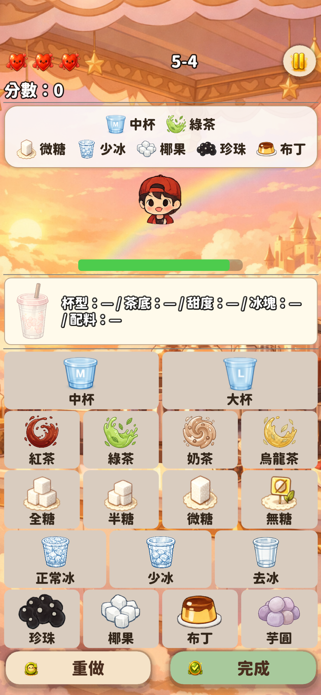
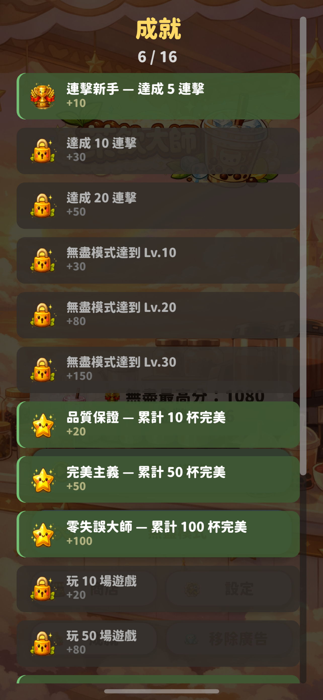
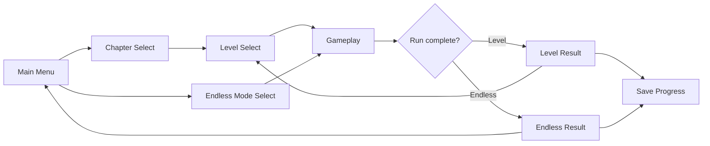
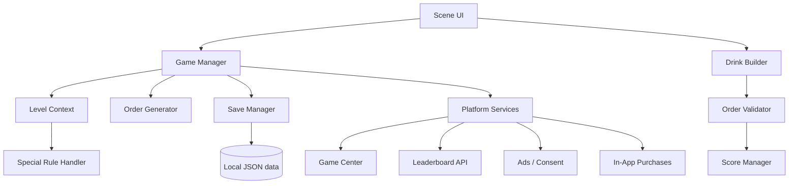

# 茶飲大師 (Bubble Tea Master)

> A two-person team shipped this portrait mobile game on the Apple App Store. Players read customer orders and assemble drinks under time pressure by choosing cup size, tea base, sweetness, ice, and toppings.

[View on the Apple App Store](https://apps.apple.com/us/app/%E8%8C%B6%E9%A3%B2%E5%A4%A7%E5%B8%AB/id6764250016)

  
  

## Overview

《茶飲大師》是一款以快速配對訂單為核心的休閒手機遊戲。玩家要在顧客耐心耗盡前完成飲料；答錯可以依關卡規則重試，但會影響生命、連擊或得分。正式版本提供 100 個關卡（20 章、每章 5 關）及多種無盡模式，並已上架 Apple App Store。

The game gradually introduces cup sizes, additional tea bases, ice levels, toppings, multiple customers, and special rules. Progress, rewards, settings, cosmetics, achievements, and best scores persist between sessions.

## My Role

I was one of two developers on the project and contributed across the full development lifecycle, including gameplay systems, UI, progression, testing, debugging and release preparation.

My contributions included:

- the initial project structure and core gameplay loop;
- drink-order generation and validation, drink-building interactions, scoring, and save data;
- the tutorial, level progression, special-rule behaviour, and expansion to 100 levels;
- endless and memory-mode behaviour, multi-customer gameplay, feature unlocks, and difficulty progression;
- gameplay UI, layout fixes, audio integration, shop behaviour, and mobile interaction fixes;
- debugging, release preparation, and stability work leading to the App Store release.

We also collaborated on localisation, visual presentation, monetisation, platform services, content balancing and final integration. Further details are available in [Contribution Evidence](docs/contribution-evidence.md).

## Tech Stack

- Godot Engine 4.6
- GDScript
- Godot scenes and Autoload singletons
- Git and GitHub collaboration
- Apple Game Center integration
- Supabase REST API for online leaderboards
- Google AdMob plugin with consent flow
- Godot iOS In-App Purchase integration

## Key Features

- 100 levels across 20 chapters, with star-based progression and unlock conditions
- normal, memory, reverse, and boss-style endless variants
- composable level rules including memory, rush, reverse, no-reset, VIP, and timed play
- data-driven drink orders with tea, sweetness, ice, cup, and topping combinations
- scoring based on correctness, speed, attempts, combos, and level modifiers
- local JSON save/load for progression, settings, inventory, cosmetics, achievements, and session recovery
- three-language UI: Traditional Chinese, English, and Japanese
- achievements, daily login rewards, milestone rewards, shop customisation, and consumable items
- online leaderboards and Apple Game Center support
- rewarded/interstitial advertising, consent handling, and iOS in-app purchases

## Development Highlights

### Shared gameplay pipeline

Level and endless play reuse the same gameplay scene. A level context carries mode-specific targets, timing, star conditions, and special rules, while shared order and scoring systems handle the main interaction. This limits duplicate gameplay logic while allowing each mode to change constraints.

### Composable challenge rules

Special rules are parsed as a set, so a level can combine behaviours such as reduced patience, hidden orders, reversed controls, and stricter validation. The memory rule also tracks cancellation generations and remaining time so pausing or changing customers does not leave stale timers active.

### Persistent progression

The save layer separates long-term player data from resumable endless-session data. It stores level stars, currency, purchases, inventory, settings, achievements, and high scores, while level runs remain intentionally non-resumable.

### Mobile release work

The project targets a 390 × 844 portrait viewport and uses mobile rendering. The repository shows repeated work on touch sizing, scrolling, layout stability, iOS font/icon behaviour, privacy declarations, ads, purchases, and release fixes.

## AI-Assisted Development

Claude was used as an AI-assisted development tool during implementation. The repository includes project guidance prepared for iterative work and commits that update that guidance alongside features and fixes. The workflow involved describing a feature or bug, reviewing generated GDScript and scene changes, testing them in the Godot project, and revising the result before integration. This supported code generation, debugging, UI iteration, and implementation planning; final integration and validation remained part of the development workflow.

The project does not claim LLM product engineering, model training, RAG, or autonomous-agent development.

## Screenshots / Demo

The main menu and gameplay screenshots appear above. These additional captures show chapter progression and achievements:

  
  

[View full-resolution screenshots](screenshots/README.md).

A gameplay video has not yet been added.

## Architecture / Gameplay Flow

More detail: [Architecture](docs/architecture.md) and [Gameplay Flow](docs/gameplay-flow.md).

## Representative Code / Technical Snippets

No production script is copied into this public repository. [The snippets directory](docs/snippets/README.md) contains short, rewritten pseudocode examples that explain the main engineering ideas without exposing the production implementation, service configuration, or licensed assets.

## Privacy / Source Code Notice

This is a public showcase repository. The complete production source code is not published.

Public material is limited to:

- project overview;
- approved screenshots or demo media;
- technical documentation;
- selected, rewritten representative snippets;
- architecture and workflow explanations.

The complete commercial product code, credentials, service configuration, signing material, and commercial or third-party assets remain private.

## Repository Status

Public portfolio showcase containing technical documentation and approved game screenshots. The production project remains private.
